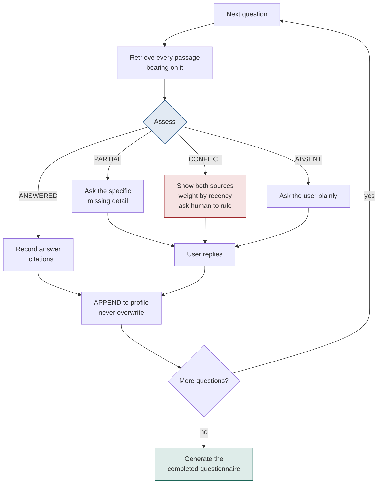

# AI Security Analyst — Architecture & Build Guide

> Regodit track · Money Talks hackathon · 5 Sep 2026 · solo · 6 hours
> Keep this file in the repo root. Paste §1–§3 into Claude Code before the first task.

---

## 1. What we are building

A chatbot that completes a **security questionnaire** about a company by reading that
company's own documents.

It **searches before it asks**, asks the user only about genuine gaps, asks smart
follow-ups, **detects where the documents contradict each other**, remembers everything,
and generates a completed questionnaire that distinguishes what was proven from what was
merely claimed.

**Thesis:** most of the answers are already in your documents. The job is knowing which
ones — and knowing what's a policy versus what's proof.

### The published rubric (build to it literally)

| Criterion | How we hit it |
|---|---|
| Finds information before asking | Retrieve + assess every question against the corpus first |
| Asks the right follow-ups | "Yes" is never a complete answer — how often, automated, tested |
| Remembers what it learns | Append-only profile, never asks twice, corrections keep history |
| Detects contradictions | Conflict state with both sources, recency-weighted |
| Never confidently makes things up | `unknown` is a valid visible state; no citation, no answer |
| Gets the questionnaire completed | A generated document is the deliverable |

---

## 2. Hard rules

1. **Never guess.** `unknown` is a real answer and stays visible.
2. **No citation, no answer.** Evidence is structural — `{docId, quote, evidenceType}`.
   If the model can't produce a verbatim quote from the corpus, it has no evidence.
3. **Never mutate on correction.** Append a new version, keep the old one.
4. **The server holds no state.** Client sends the profile up, gets it back.
5. **PRISM tracing is never awaited** on the request path.
6. **No feature** that isn't one of: answers-with-evidence, asks-when-missing,
   conflict detection, generated questionnaire.

### Stack

Next.js (App Router) · **JavaScript, not TypeScript** · Tailwind · Vercel
**No database. No vector store. No auth.**

Retrieval is **full-context first** — pass the relevant documents straight to the model.
Only chunk if the corpus genuinely doesn't fit. It's more accurate and needs no infra.

---

## 3. Architecture

```mermaid
graph LR
    subgraph B["Browser"]
        UI["Chat panel<br/>Questionnaire panel<br/><b>holds THE PROFILE</b>"]
    end
    subgraph S["Next.js API route"]
        CHAT["POST /api/chat"]
    end
    subgraph L["lib/"]
        CORPUS["corpus.js<br/>documents in memory"]
        ASSESS["assess.js<br/>the 4-way router"]
        PRISM["prism.js<br/>emitTrace"]
    end
    EXT[("PRISM")]

    UI -->|"message + profile"| CHAT
    CHAT -->|"reply + profile' + evidence"| UI
    CHAT --> CORPUS
    CHAT --> ASSESS
    CHAT -.->|"after&#40;&#41; — fire and forget"| PRISM
    PRISM -.-> EXT
```



**Why the server is a pure function:** serverless instances don't share memory, so any
cache written by one request may not exist for the next. The client holding the profile
removes that entire class of bug and means we never write a database.

---

## 4. The core loop

This loop **is** the product. The routing decision in step 2 is what separates this from
fifteen other chat boxes.



### The failure mode that loses this track

A naive build either asks the user all 20 questions, or answers all 20 from documents
with no citations. Both are obvious to a judge in 30 seconds.

---

## 5. Data structures

### The four answer states

| State | Meaning | Colour |
|---|---|---|
| `verified` | Found in company documents, with a quotable citation | green |
| `confirmed` | The user told us; recorded for next time | blue |
| `unknown` | An honest, visible gap — a feature, not a failure | amber |
| `conflict` | Sources disagree; unresolved until a human rules | red |

> They asked for three states. **Adding `conflict` as its own state is why we stand out.**

### The three evidence types

| Type | Is | Example |
|---|---|---|
| `observed` | **Reality** | config export, scan result, access log |
| `attested` | **Intent** | policy, handbook, signed standard |
| `asserted` | **Testimony** | a human said so |

> A policy saying "MFA is mandatory" is *not* evidence that MFA is enabled. It's
> evidence that someone wrote it down. That gap is the whole discipline of security
> auditing, and almost every team will collapse it.

### Profile

```js
Profile = {
  companyName,
  answers: {
    mfa_enabled: {
      status:     "verified",          // verified | confirmed | unknown | conflict
      value:      "Yes — mandatory on Google Workspace and GitHub",
      evidence:   [{ docId, docName, quote, evidenceType, date }],
      confidence: 0.94,
      conflicts:  [],
      followUps:  [{ q: "How often reviewed?", a: "Quarterly" }],
      history:    [{ at, from, to, by: "user" | "corpus", reason }]
    }
  },
  askedQuestions: [],   // so it never repeats itself
  openConflicts:  []
}
```

### Assess output (strict JSON)

```js
{
  status: "answered" | "partial" | "conflict" | "absent",
  value, confidence,
  evidence: [{ docId, quote, evidenceType }],   // reject items without a quote
  followUpQuestion,
  conflict: {
    sources: [{ docId, quote, date }, ...],
    nature: "policy_vs_observed_exception",
    proposedQuestion: "..."
  }
}
```

---

## 6. File tree

```
security-analyst/
├─ data/                        # their corpus, dropped in as-is
├─ lib/
│  ├─ corpus.js                 # load docs into memory {docId,docName,date,text}
│  ├─ assess.js                 # THE PRODUCT — the 4-way router
│  ├─ questionnaire.js          # the question list + generation
│  └─ prism.js                  # emitTrace
├─ app/
│  ├─ api/chat/route.js         # the only route that matters
│  ├─ page.js                   # single page, all state
│  └─ globals.css
└─ components/
   ├─ ChatPanel.jsx
   ├─ QuestionnairePanel.jsx    # what judges watch
   ├─ EvidenceDrawer.jsx
   └─ CoverageBar.jsx
```

---

## 7. API contract

```
POST /api/chat
req  { message, profile, currentQuestionId }
res  { reply, profile, action, evidence[] }

action = "answered" | "asked_followup" | "raised_conflict"
       | "asked_missing" | "recorded_correction"
evidence = [{ docId, docName, quote, evidenceType }]
```

### One turn, end to end

```mermaid
sequenceDiagram
    participant U as User
    participant C as Client
    participant R as /api/chat
    participant M as Model
    participant P as PRISM

    U->>C: types an answer
    C->>R: message + full profile
    R->>R: retrieve from corpus
    R->>M: question + passages + profile
    M-->>R: strict JSON assessment
    R->>R: validate every quote exists in corpus
    R-->>C: reply + updated profile + evidence
    C->>C: render, persist to localStorage
    R--)P: emitTrace in after&#40;&#41; — never awaited
```



---

## 8. PRISM

```bash
PRISMTRACE_HOST=https://prism-api-prod.up.railway.app   # NOT the docs URL
PRISMTRACE_PROJECT_ID=b5f37218-75f4-4ba2-b5aa-2d9ae660dde3
PRISMTRACE_API_KEY=pt-sk-ab83...    # ingest-scoped, from the 5 Sep setup brief

# SUPERSEDED 5 Sep: project 37ddd296-... and the key ending ffde68 are dead.
# The live key lives only in .env.local, never in this file.
```

```js
// header is X-PRISMtrace-Key — NEVER Authorization: Bearer
import { after } from 'next/server';

after(() => emitTrace({
  project_id: PROJECT_ID,
  model, latency_ms,
  input_messages: [{ role: 'user', content: question }],
  output_message: answer,
  session_id: runId,              // one interview — CANNOT be backfilled
  agent_id: 'security-analyst',   // stable, or it splits into many
  metadata: { questionId, status, evidenceType, citationCount, confidence }
}).catch(() => {}));              // tracing must never break the app
```

| Feature | Use | Where | Cost |
|---|---|---|---|
| **Traces** | one per question→answer exchange | code | 15 min |
| **Sessions** | `session_id` = one interview | code | free once traces work |
| **Scores** | automatic; *flagged for review* = hallucination/self-contradiction | dashboard | **no code** |
| **Alerts** | one rule: `compliance_score < 60` → human warned | dashboard | 5 min |
| **Knowledge Base** | upload the corpus. *Honest:* grounding is Builder-only, so on Free it's storage + a real integration, not retrieval | dashboard | 10 min |
| **Agent Runs** | trajectory of one interview | free | 0 |
| **Root Cause** | skip — 5 credits, clusters failures we shouldn't have | — | — |

**Wire PRISM at ~13:00, not at the end.** Then every test you run all afternoon
populates the dashboard, and by demo time you have a hundred real traces instead of a
staged handful.

**The line it buys you:** *"We don't just claim it doesn't hallucinate. Every answer
went through PRISM's scoring. Twenty answers, zero flagged for review — and that's
their judgement, not ours."*

---

## 9. Build tasks, in order

> One task per prompt. Run it, commit, next. **Never** ask for the whole app.

| # | Task | Done when |
|---|---|---|
| 01 | **Scaffold** — create-next-app (JS, Tailwind), GitHub, Vercel | placeholder live on a URL |
| 02 | **Corpus + route skeleton** — `lib/corpus.js`, `POST /api/chat` returning a hardcoded reply | round trip works |
| 03 | **The assess engine** ← *the product, give it the most time* | strict JSON out, every quote validated against the corpus |
| 04 | **PRISM tracing** — `lib/prism.js`, called inside `after()` | traces visible in the dashboard |
| 05 | **Chat UI + profile state** — client holds profile, localStorage | conversation works, evidence chips render |
| 06 | **Questionnaire panel** — one row per question, four colours, live | *the demo now exists* |
| 07 | **Conflict detection** — both sources, recency weighting, proposed question | the planted conflict is caught |
| 08 | **Evidence typing + coverage bar** — observed/attested/asserted, `14 · 4 · 2 · 0` | header updates live |
| 09 | **Follow-ups + evidence drawer** — backups→frequency→automated; click to source | drawer shows the quote |
| 10 | **Generate questionnaire** — the deliverable document with states and citations | it looks like a document |

### Working with Claude Code

- **One file per prompt.** A big-bang request returns 800 lines you can't debug — and
  you have to demo this. "How does conflict detection work?" is a question about your code.
- **Run and commit before moving on.** You want a known-good state at 3pm.
- **Paste real errors**, not descriptions. If a fix doesn't land in two attempts,
  revert and re-prompt rather than patching a patch.

---

## 10. The day

| Time | Block | Min |
|---|---|---|
| 09:30 | GIDE installed · PRISM trace posted · seat near power | 30 |
| 10:00 | Opening — write criteria verbatim, then **read their corpus** and find the planted conflict | 30 |
| 10:30 | Map every question: answerable / needs asking / contradictory — *this map is the demo script* | 25 |
| 10:55 | Task 01 scaffold + deploy | 25 |
| 11:20 | Task 02 corpus + route | 40 |
| 12:00 | **Task 03 assess engine** | 70 |
| 13:10 | Task 04 PRISM | 15 |
| 13:25 | Task 05 chat UI | 40 |
| 14:05 | Task 06 questionnaire panel | 40 |
| 14:35 | Task 07 conflicts | 35 |
| 15:10 | Sponsor tables — Regodit above all | 20 |
| 15:30 | Tasks 08–09 evidence typing, follow-ups, drawer | 40 |
| 16:10 | Task 10 generate + coverage bar | 25 |
| **16:35** | **HARD FREEZE** — deploy, record, write the submission | 25 |
| 17:00 | Rehearse ×3 on a timer | 15 |
| 17:15 | Demo — volunteer to go first | 45 |

---

## 11. Cut rules

**The demo is four things:** answers-with-evidence · asks-when-missing · the conflict ·
the generated questionnaire. Those four *are* the rubric.

**Cut in this order:** evidence drawer (show quotes inline) → follow-up chains →
corrections and updates → coverage bar.

**Never cut:** conflict detection (the differentiator) or the generated questionnaire
(the stated deliverable).

### Not in scope, however tempting
A vector database · multiple stakeholders · voice · auto-generating questionnaires ·
manager dashboard · multilingual. All on their bonus list; all cost the four things
that actually score.

### Three rules for the demo
1. Never show code.
2. Never say "I ran out of time." Unknown answers are a designed feature — say so.
3. If it breaks, keep talking and cut to the recording.
