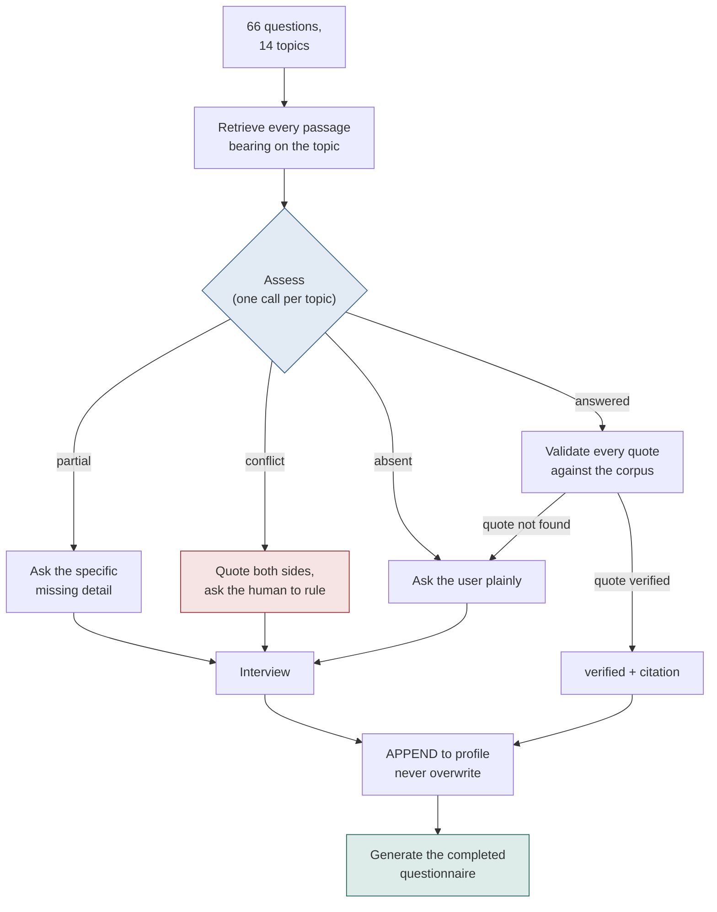

# AI Security Analyst

**Completes a vendor security questionnaire by reading the vendor's own documents — and refuses to answer anything it cannot quote.**

Built for the Regodit track, Money Talks hackathon (5 Sep 2026).

---

## The problem

Every enterprise deal stalls at the same place: a 66-question security questionnaire lands
in someone's inbox, and a human spends days hunting through policies, audit reports and
infrastructure exports to answer it. Two things go wrong:

1. **The answers are already written down** — in the access control policy, the VAPT
   report, the SOC 2, the access review records. Nobody knows which document holds which
   answer, so the questions get asked again from scratch.
2. **The answers that come back are unreliable.** "Yes, we enforce MFA" gets copied from a
   policy. But a policy saying a control is mandatory is *not* evidence the control is
   switched on. A pentest report recommending that the control be implemented is evidence
   it isn't. Questionnaires collapse that distinction, and so does every LLM you point at
   the problem — it will happily write a confident, unsourced "Yes" for all 66 rows.

The failure mode that makes this worthless is an assistant that either asks the human all
66 questions, or answers all 66 with no citations. Both are obvious in 30 seconds.

## The solution

An analyst that **searches before it asks**. It reads the corpus first, answers what the
documents actually support, and only then opens a conversation with the human — about the
genuine gaps and about the places where the company's own documents contradict each other.

Every answer lands in one of five visible states, and the amber and red ones are the point:

| State | Meaning |
|---|---|
| 🟢 `verified` | Found in the documents, with a quotation from a named source |
| 🔵 `confirmed` | The human told us during the interview |
| 🟣 `partial` | Answered, but a specific detail is still missing |
| 🟠 `unknown` | An honest, visible gap — **a feature, not a failure** |
| 🔴 `conflict` | Sources disagree; unresolved until a human rules on it |

On the shipped corpus pass over Regodit's documents: **12 verified · 16 partial · 5
conflict · 33 unknown**, backed by **48 validated citations** (20 observed, 28 attested).
Nothing was inferred. The 33 unknowns are deliberate.

---

## Key features

**1. No citation, no answer.**
The model proposes evidence; the server disposes of it. Every quote is checked
character-for-character against the corpus text by `keepOnlyRealEvidence`
([lib/corpus.js](lib/corpus.js)). A quote that isn't found verbatim is dropped, and if
nothing survives, the answer is downgraded to `unknown` and the value is thrown away. This
is what makes a small, fast, free-tier model safe to use here.

**2. Observed vs. attested — the distinction that is the whole job.**
Evidence is typed. `observed` is reality: a VAPT finding, an access review record, an asset
register, a network diagram. `attested` is intent: a policy, a plan, an auditor's opinion.
`asserted` is testimony: a human said so. A policy stating "MFA is mandatory" is evidence
that *somebody wrote it down*, and the UI never lets you confuse the two.

**3. Conflict detection — the differentiator.**
`conflict` is a first-class state, not an error. The assess prompt names the specific
patterns that are conflicts rather than answers — a pentest recommending a control a policy
claims is already enforced; a review record with an outstanding action; two observed
records disagreeing; a document whose provenance undercuts it. Both sides are quoted, and
a conflict only survives if **both** quotes pass validation.

> Real find, question 19: the Master Services Agreement says PII must "not process or
> maintain the PII outside the United States". The employment contract says the same
> sentence with **India**. Same clause, two jurisdictions, in the same company's paperwork.

**4. It interviews; it doesn't fill in a form.**
The conversational turn ([lib/converse.js](lib/converse.js)) classifies what the person
actually said — `answer`, `clarify`, `challenge`, `skip`, `smalltalk`, `meta` — *before*
anything is written down. "hey" is never recorded as a vendor's official answer to a
security control. And "yes" is never a complete answer: it drills **how often → automated →
last tested → who owns it**, one closed question at a time, and never re-asks what it has
already been told.

**5. It never forgets, and never overwrites.**
The profile is append-only. A correction pushes the previous state onto `history` with its
provenance, so the old value and who changed it survive
([`recordUserAnswer`](lib/profile.js)). It never asks the same question twice.

**6. The deliverable is a document.**
`/questionnaire` renders the completed questionnaire — grouped by topic, every state
labelled, every citation quoted with its source and evidence type, every unresolved
conflict shown with both sides and the outstanding question. Print to PDF or download.

**7. Every model call is traced to PRISM.**
Sessions, latency, and per-answer metadata (status, evidence type, citation count, rejected
quote count, confidence). Tracing is fired inside `after()` and every failure path swallows
— it can never break the request.

**8. It reports defects in the client's own questionnaire.**
Q52 is blank in the workbook Regodit shipped. Rather than silently dropping it, it's kept
and surfaced as an honest gap — a hidden question is a question we failed to answer.

---

## Tech stack

| | |
|---|---|
| Framework | Next.js 16 (App Router), React 19 — **JavaScript, not TypeScript** |
| Styling | Tailwind CSS v4 |
| Inference | Groq — `openai/gpt-oss-120b` for assessment, `openai/gpt-oss-20b` for the interview |
| Retrieval | Keyword scoring over paragraphs, hand-tuned security synonyms — **no embeddings, no vector store** |
| Observability | PRISM (traces, sessions, scoring) |
| Storage | **None.** No database, no auth. The client holds the profile in `localStorage` |
| Deploy | Vercel |

**Why no vector database?** Groq's free tier is ~8,000 tokens/minute, and the corpus is
~695k characters — it cannot go into context whole. But it also doesn't need embeddings:
security questionnaires and security documents have a small, closed vocabulary. Keyword
retrieval with a synonym table (`mfa` → `multi-factor`, `multifactor`, `2fa`, `otp`, …)
pulls the right paragraphs, costs nothing, needs no infrastructure, and is inspectable when
it goes wrong.

**Why is the server stateless?** Serverless instances don't share memory, so any cache one
request writes may not exist for the next. The client posting the profile up and getting it
back removes that entire class of bug and means we never write a database.

---

## How it works



### The corpus pass (offline, cached)

`scripts/build-answers.mjs` walks all 14 topics, one Groq call each. Batching by topic is
forced by the rate limit — but it also assesses *better*, because the model sees a whole
control area at once, so a policy claim and the finding that undercuts it are weighed
together instead of in separate calls. The run costs ~90k tokens and is cached to
`data/answers.json`, so the demo never depends on a live API call while judges are
watching. Each answer is traced to PRISM as it lands.

Before choosing a status, the model must fill in `observedCheck` — stating what the
observed passages show, or "none present". It may not answer `answered` on policy evidence
alone while observed passages about the same control sit unaddressed in front of it.

### The interview (live)

```
POST /api/chat   { message, profile, currentQuestionId, history }
              →  { reply, profile, action, recorded, coverage, nextQuestionId, evidence[] }
```

The server is a pure function: profile in, profile out, nothing stored.

### Corpus and evidence typing

`data/corpus.json` holds 25 extracted documents. The questionnaire workbook itself is
excluded from the evidence corpus — it's where the *questions* come from, not proof about
the company. Evidence type defaults from the source folder, with per-document overrides
where the folder lies: architecture diagrams describe the system *as built* (`observed`),
while a BCP/DR plan is a plan, not a drill record (`attested`).

### Layout

```
lib/
  corpus.js         documents in memory · quote validation · evidence typing
  retrieve.js       keyword retrieval over paragraphs, security synonyms
  assess.js         the 4-way router — the product
  converse.js       the interview turn: intent classification + follow-up drilling
  questionnaire.js  the 66 questions, batched by topic
  profile.js        append-only state, coverage, next open question
  prism.js          emitTrace, never awaited
app/
  page.js                    the interview — chat + live questionnaire panel
  questionnaire/page.js      the deliverable, at its own URL
  api/chat/route.js          the only route that matters
  api/questionnaire/route.js renders the completed document
  api/profile/route.js       the starting profile
scripts/
  build-answers.mjs   the cached corpus pass
data/                 corpus.json · questions.json · answers.json · pdf/
```

---

## How to run it

```bash
npm install
```

Copy the env template and fill it in:

```bash
cp .env.example .env.local
```

| Variable | Purpose |
|---|---|
| `GROQ_API_KEY` | Required. Free key from [console.groq.com](https://console.groq.com) |
| `GROQ_MODEL` | Assessment model (default `openai/gpt-oss-120b`) |
| `GROQ_CHAT_MODEL` | Interview model (default `openai/gpt-oss-20b`) — separate, so a corpus rebuild can't starve the live chat of its daily token budget |
| `PRISMTRACE_API_KEY` | Optional. Tracing skips cleanly if unset |
| `PRISMTRACE_PROJECT_ID` | Optional |
| `PRISMTRACE_HOST` | Optional |

Then:

```bash
npm run dev
```

Open <http://localhost:3000>. The questionnaire is already answered from
`data/answers.json` — no API call needed to see the result.

To re-run the full corpus pass (~13 minutes; it deliberately paces itself against the
8,000 tokens/minute limit rather than absorbing 429s):

```bash
node scripts/build-answers.mjs
```

### Using it

1. **Open `/`.** The left panel is the interview; the right panel is all 66 questions,
   live, colour-coded. The coverage bar at the top counts the five states and the evidence
   types beneath them.
2. **Click any red row.** Both conflicting sources are quoted, with their evidence types.
   Rule on it in the chat and it becomes `confirmed` — the original stays in `history`.
3. **Answer an amber row.** Say "yes" and watch it drill: how often, automated, last
   tested. Say "hey" and watch it record nothing.
4. **Click through to `/questionnaire`.** The completed document, with every citation and
   every remaining gap. Print to PDF or download.

---

## Design rules this build does not break

1. **Never guess.** `unknown` is a real answer and stays visible.
2. **No citation, no answer.** Enforced in code, not in the prompt.
3. **Never mutate on correction.** Append to `history`; keep the old value.
4. **The server holds no state.**
5. **Tracing is never awaited** on the request path, and every failure swallows.

## Deliberately out of scope

A vector database · multiple stakeholders · voice · auto-generating new questionnaires ·
a manager dashboard · multilingual. Each costs time from the four things that decide this:
answers-with-evidence, asks-when-missing, the conflict, and the generated questionnaire.

---

*Corpus, questionnaire and document set supplied by Regodit for the hackathon. All figures
above are from the cached run in `data/answers.json`.*
